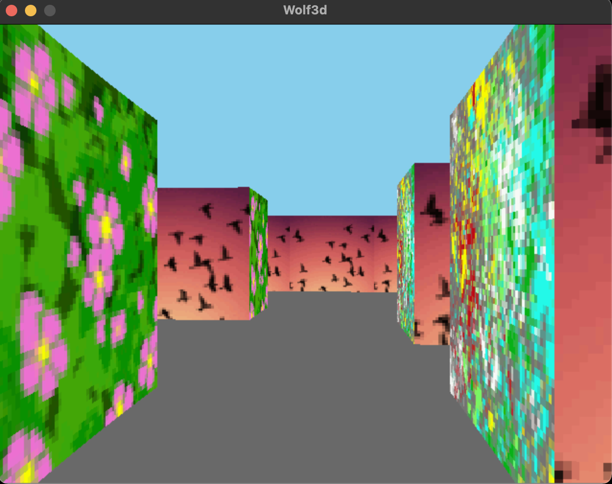

#Wolf3d
Hive Helsinki raycaster project
The idea of the project is to create a simple raycaster engine. You can create own maps with text files: 
1 = wall 
0 = floor 
2 = spawn 
Graphics library used SDL 2 (only basic things like opening a window and putting image to screen)

